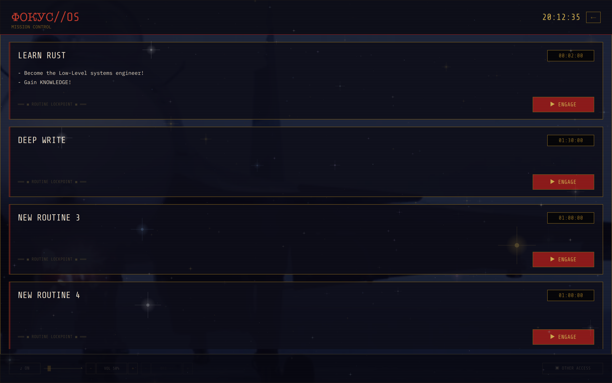
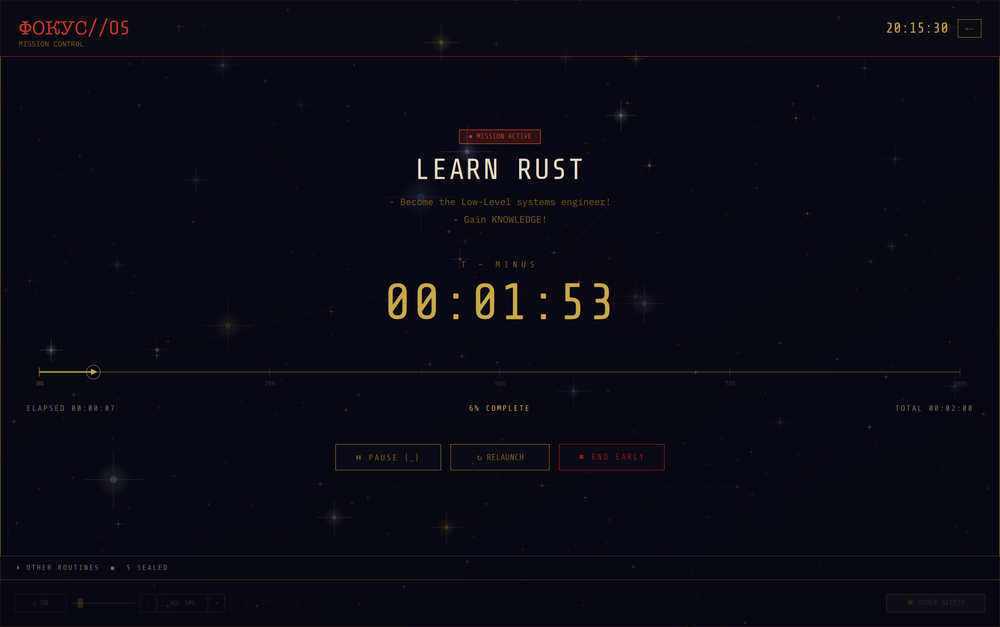
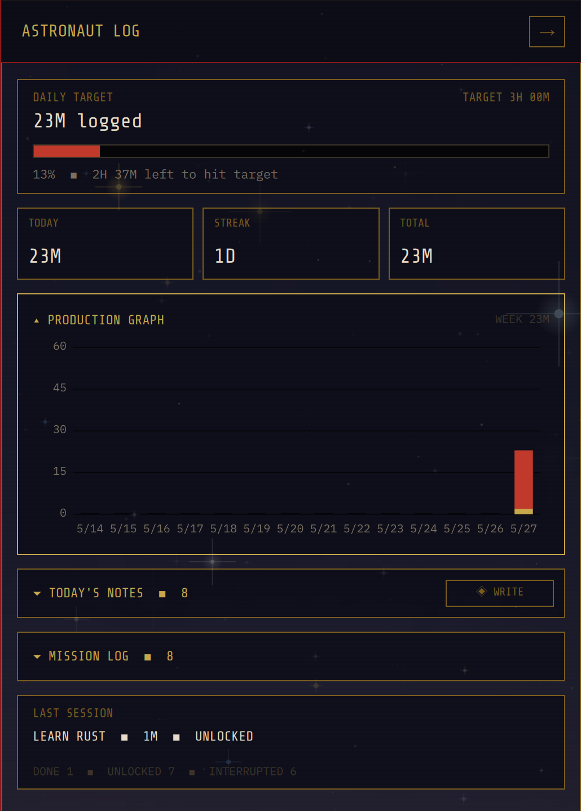
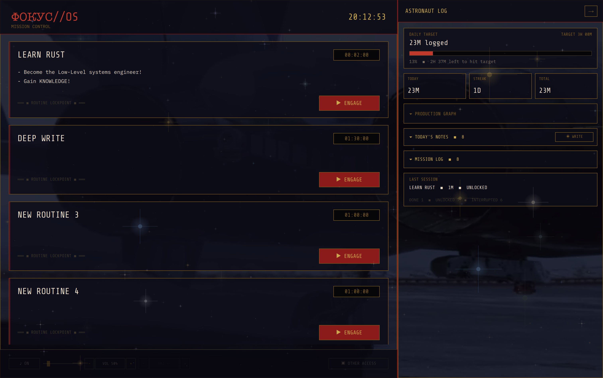
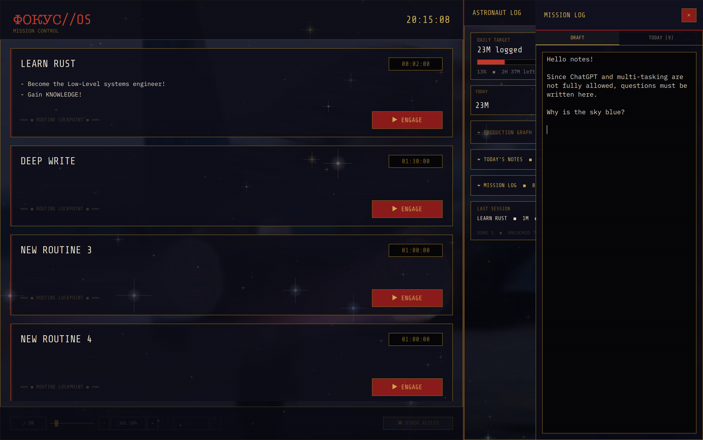
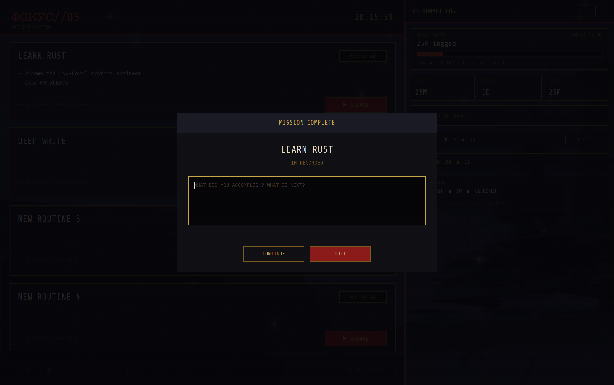
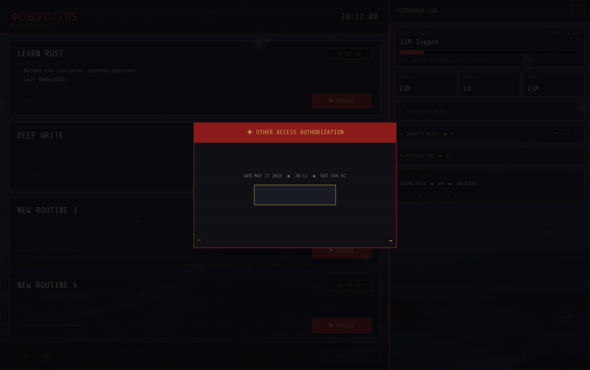

<div align="center">

# FocusOS

### A full-screen mission-control shell for intentional work.

FocusOS replaces the normal desktop with a sealed routine environment. On Linux
it is designed to run as the login session, launch only the work surfaces a
routine needs, and remove the usual dock, launcher, notifications, and open web
escape paths.

[](#)
[](#)
[](#)
[](#)

</div>

<div align="center">



<em>Mission Control: routines as launchable missions over a calm ambient field.</em>

</div>

## What It Does

FocusOS turns a machine into a focused work console. A routine defines the apps,
domains, timer, notes, and minimum commitment for a session. Engaging the
routine launches the allowed work, applies the lockdown posture, tracks the
session, and keeps the shell in front until the routine ends or a trusted person
unlocks Settings with a TOTP code.

The strict target is Linux with SDDM, KWin Wayland, nftables, and a dedicated
non-admin user. The macOS build remains useful for UI work and softer focus
testing, but macOS cannot provide the same session-replacement boundary without
managed-device tradeoffs.

## Highlights

- Full-screen Qt/QML shell with C++ core services.
- Linux login-session replacement through SDDM and KWin Wayland.
- Routine-driven app launch, timer state, notes, stats, and completion prompts.
- nftables outbound allowlist during locked routines.
- Chromium-family browser extension for document-navigation allowlists.
- TOTP-gated Settings, recovery, routine editing, and temporary unrestricted access.
- Respawn watchdog and active-session checkpointing for crash/kill resilience.
- Ambient image/video inspiration folder and optional local music folder.
- In-app no-sudo updater with binary snapshot, probation window, and auto-revert.

## Screenshots

<div align="center">

<table>
  <tr>
    <td width="50%"></td>
    <td width="50%"></td>
  </tr>
  <tr>
    <td align="center"><strong>Active Mission</strong><br/><em>Countdown, pause, relaunch, or end controls.</em></td>
    <td align="center"><strong>Astronaut Log</strong><br/><em>Daily target, streak, totals, and production graph.</em></td>
  </tr>
  <tr>
    <td width="50%"></td>
    <td width="50%"></td>
  </tr>
  <tr>
    <td align="center"><strong>Console + Log</strong><br/><em>Routines beside the current work record.</em></td>
    <td align="center"><strong>Mission Notes</strong><br/><em>Capture thoughts without leaving the shell.</em></td>
  </tr>
  <tr>
    <td width="50%"></td>
    <td width="50%"></td>
  </tr>
  <tr>
    <td align="center"><strong>Mission Complete</strong><br/><em>Record what changed before standing down.</em></td>
    <td align="center"><strong>Access Authorization</strong><br/><em>TOTP-gated access to protected controls.</em></td>
  </tr>
</table>

</div>

## Quick Start

FocusOS requires CMake 3.24+, Qt 6.7+, a C++20 compiler, and the Qt Quick/QML
and Multimedia modules.

```bash
cmake -S . -B build
cmake --build build
ctest --test-dir build
```

Run the development build:

```bash
./build/focusos
```

On macOS, CMake produces `build/focusos.app`:

```bash
open build/focusos.app
```

For the permanent Linux session install, recovery path, and distro dependencies,
use [INSTALL.md](INSTALL.md).

## Repository Layout

```text
CMakeLists.txt              Top-level Qt/CMake project.
src/
  main.cpp                  Process entry, backend selection, object wiring.
  core/                     Routine, timer, notes, stats, TOTP, media, updater.
  blocker/                  Signed browser-policy model and native host mode.
  platform/                 macOS and Linux implementations behind PlatformBackend.
  shell/                    QQuickView host and all QML surfaces.
assets/                     Bundled fonts, QML theme, ambient music, screenshots.
resources/
  Cold Turkey/              Pristine upstream extension snapshot.
  focusos-blocker/          FocusOS-controlled browser blocker extension.
scripts/                    Blocker packaging, policy install, diagnostics, updates.
packaging/linux/            SDDM session, watchdog, updater, recovery, KDE config.
tests/                      Qt Test coverage.
docs/                       Architecture and operations guides.
```

## Documentation

- [Install and recovery](INSTALL.md) - build, test, Linux session install, update, uninstall.
- [Agent guide](AGENT.md) - orientation for AI or human contributors entering the repo.
- [Architecture decisions](docs/architecture-decisions.md) - current product and technical decisions.
- [Browser blocker operations](docs/browser-blocker.md) - extension delivery, native host, diagnostics.
- [Blocker component README](resources/focusos-blocker/README.md) - protocol and source-tree details.

## Runtime Data

FocusOS creates `~/.focusos/` on first launch. Important paths include:

- `~/.focusos/routines.json` - editable routine definitions.
- `~/.focusos/config.json` - user configuration shared by Settings surfaces.
- `~/.focusos/stats.json` - session history and active-session state.
- `~/.focusos/active.json` - armed routine checkpoint used by the watchdog.
- `~/.focusos/inspiration/` - user-provided ambient images/videos.
- `~/.focusos/music/` - optional local `.mp3`/`.ogg` music.
- `~/.focusos/blocker/` - signed browser-blocking policy, logs, and extension dist files.

## Security Boundary

FocusOS is intended to strongly constrain a normal non-admin daily-use account.
It is not a defense against someone with root, firmware access, full disk
access, recovery media, or a willingness to modify the operating system. The
recommended deployment model is a dedicated non-admin FocusOS user plus a
separate admin account kept for maintenance and recovery.
